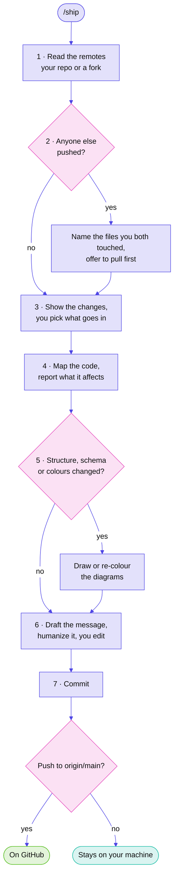

# ship

A Claude Code skill for getting work onto GitHub without surprises.

You see every step before it happens, and nothing reaches GitHub until you say yes to that specific push.

## Why

Two things go wrong when an agent has access to your repo.

The first is that it pushes something you hadn't finished reading. The second is quieter: you and whoever you're working with both edit the same file, they cloned before your last push, and nobody finds out until the merge is already a mess.

This skill handles both. It shows you the diff before staging, names the files a collaborator has touched before you push over them, and asks separately for the commit and the push.

## Commands

| Command | Does |
|---|---|
| `/ship` | Review, commit and push, with every step shown first |
| `/ship docs` | A one-time docs makeover for a project that existed before ship did |

Asking in plain words works too. "Commit this" or "push my work" starts the same flow.

## What it does

When you type `/ship`, it works through seven steps:

1. Reads your remotes to work out whether you're on a shared repo or a fork
2. Fetches, and tells you if someone has pushed commits you don't have yet
3. Shows what changed, flagging anything that looks unfinished
4. Maps your code the first time it runs, without asking, then reports what each change affects
5. Writes or updates Mermaid diagrams when structure or the database schema changes, coloured to match your project, and re-colours them whenever your project's colours change
6. Drafts a commit message in your own voice and lets you edit it
7. Asks before pushing, naming the exact remote and branch

<!-- Diagram colours: ship's neutral palette, since this repository has no stylesheet or logo. -->



## The docs makeover

`/ship docs` is for a project that existed before ship did. It maps the code first, then draws diagrams wherever the code supports one, in your project's colours. It adds a logo header and badges to the README, and rewrites the prose in the README and your other docs so it reads like a person wrote it.

Files written for a tool to read stay as they are: `CLAUDE.md`, prompt files, or a design tool's `PRODUCT.md`. When a doc says something the code no longer does, it tells you rather than correcting it on its own. You see the full diff first, nothing is deleted, and nothing is committed without a yes. Running it a second time only fixes what has drifted.

## What it won't do

- Push without a yes for that specific push
- Push to `upstream`, because a fork's original belongs to someone else
- Force-push or edit a workflow without a typed confirmation
- Commit a file you haven't seen listed
- Rewrite a collaborator's commits
- Open a pull request or issue unless asked
- Change repository settings

## Install

```bash
npx skills add divyanshjoshii/ship -g
```

The `-g` makes it available in every project, including ones you haven't created yet.

## Commit trailers

Coding agents commonly append a `Co-Authored-By` trailer to commit messages. Removing it is a git setting rather than something this skill controls. A `commit-msg` hook strips the line locally, on every commit, whatever wrote it.

Run these two once. Windows users want Git Bash, not PowerShell.

```bash
mkdir -p ~/.githooks && cat > ~/.githooks/commit-msg <<'EOF'
#!/bin/sh
grep -v -i '^Co-authored-by:' "$1" > "$1.tmp" && mv "$1.tmp" "$1"
EOF
```

```bash
chmod +x ~/.githooks/commit-msg && git config --global core.hooksPath ~/.githooks
```

That covers every repository on the machine, permanently.

To check it took, commit something with the line in it and read back what saved:

```bash
git log -1 --format=%B
```

Two things to know. It only affects commits made from now on, so anything already in your history keeps the line. And setting `core.hooksPath` globally overrides per-repository hooks, so a project using Husky will take that folder over and the hook stops applying there. Add the same lines to the project's Husky hooks if you need it.

## Optional companions

`ship` works on its own. These make it better where they're present, and it skips them silently where they aren't:

| Tool | Adds |
|---|---|
| [code-review-graph](https://github.com/tirth8205/code-review-graph) | A map of your code, built once without asking. Step 4 uses it to report what a change affects, and the makeover draws its architecture diagram from it |
| [humanizer](https://github.com/blader/humanizer) | Commit messages and docs that read like you wrote them |

It won't prompt you to install any of these mid-commit.

Diagrams need no companion at all. Step 5 writes Mermaid, which GitHub draws on its own, and colours it from your project's CSS variables, Tailwind config or logo. Change any colour and ship notices on the next push. When a browser tool is available, each diagram is rendered on GitHub's light and dark backgrounds before it's committed.

## Pairs well with

[groundwork](https://github.com/divyanshjoshii/groundwork) interviews you once at project start and writes the rules file every later session reads. On a project that already has code, it finishes by handing over to `/ship docs`. Groundwork sets the rules, and ship checks your work against them before it reaches GitHub.

## Requirements

Git, and Claude Code. `gh` is only needed if you want it to create a repository for you. `palette.mjs` reads your project's colours using Node, which `npx skills add` already needs, so there is nothing extra to install.

## Licence

MIT
