# ship

A Claude Code skill for getting work onto GitHub without surprises.

You see every step before it happens, and nothing reaches GitHub until you say yes to that specific push. It reads GitHub whenever it needs to, and asks before anything that writes to it.

## Why

Two things go wrong when an agent has access to your repo.

The first is that it pushes something you hadn't finished reading. The second is quieter: you and whoever you're working with both edit the same file, they cloned before your last push, and nobody finds out until the merge is already a mess.

This skill handles both. It shows you the diff before staging, names the files a collaborator has touched before you push over them, and asks separately for the commit and the push.

## Commands

| Command | Does |
|---|---|
| `/ship` | Review, commit, push and open a pull request, with every step shown first |
| `/ship inbox` | What changed on GitHub since you last looked. Reads only |
| `/ship docs` | A one-time docs makeover for a project that existed before ship did |

Asking in plain words works too. "Commit this", "push my work" or "anything new on GitHub?" starts the matching flow.

## What it does

When you type `/ship`, it works through eight steps:

1. Reads your remotes to work out whether you're on a shared repo or a fork
2. Fetches, and tells you if someone has pushed commits you don't have yet. If your feature branch has fallen behind the default branch, it offers a rebase with a backup branch made first
3. Shows what changed, flagging anything that looks unfinished
4. Maps your code the first time it runs, without asking, then reports in a few lines what each change affects
5. Writes or updates Mermaid diagrams when structure or the database schema changes, coloured to match your project, and re-colours them whenever your project's colours change
6. Puts the work on a branch of its own when your project uses pull requests
7. Drafts a commit message in your own voice and lets you edit it
8. Asks before pushing, naming the exact remote and branch, and asks again before opening the pull request, which you merge yourself

```mermaid
%%{init: {"theme":"base","themeVariables":{"background":"#FFFFFF","primaryColor":"#FFFFFF","primaryTextColor":"#0B0B0B","primaryBorderColor":"#4F46E5","lineColor":"#4F46E5","secondaryColor":"#EAE9FC","tertiaryColor":"#FFFFFF","textColor":"#0B0B0B","edgeLabelBackground":"#FFFFFF","clusterBkg":"#FFFFFF","clusterBorder":"#CECECE","titleColor":"#0B0B0B","rowOdd":"#FFFFFF","rowEven":"#F0F0F0","attributeBackgroundColorOdd":"#FFFFFF","attributeBackgroundColorEven":"#F0F0F0","actorBkg":"#FFFFFF","actorBorder":"#4F46E5","actorTextColor":"#0B0B0B","actorLineColor":"#919191","signalColor":"#4F46E5","signalTextColor":"#0B0B0B","labelBoxBkgColor":"#FFFFFF","labelBoxBorderColor":"#4F46E5","labelTextColor":"#0B0B0B","loopTextColor":"#0B0B0B","noteBkgColor":"#E5E3FB","noteTextColor":"#0B0B0B","noteBorderColor":"#4F46E5","activationBkgColor":"#4F46E5","activationBorderColor":"#4F46E5"}}}%%
%% palette 97d170e1
flowchart TD
    A(["/ship"]) --> B["1 · Read the remotes<br/>your repo or a fork"]
    B --> C{"2 · Anyone else<br/>pushed?"}
    C -->|yes| C2["Name the files you both touched,<br/>offer to pull first"]
    C -->|no| D
    C2 --> D["3 · Show the changes,<br/>you pick what goes in"]
    D --> E["4 · Map the code,<br/>report what it affects"]
    E --> F{"5 · Structure, schema<br/>or colours changed?"}
    F -->|yes| G["Draw or re-colour<br/>the diagrams"]
    F -->|no| H
    G --> H["6 · Pick the branch<br/>7 · Draft the message, you edit"]
    H --> I["8 · Commit"]
    I --> J{"Push?"}
    J -->|yes| P{"Pull request<br/>flow?"}
    J -->|no| L(["Stays on your machine"])
    P -->|no| K(["On GitHub"])
    P -->|yes| Q{"Open the PR?"}
    Q -->|yes| R(["PR open,<br/>you merge it"])
    Q -->|no| K

    classDef role1 fill:#E3E1FB,stroke:#4F46E5,color:#0B0B0B
    classDef role2 fill:#FBE1F4,stroke:#E546BC,color:#0B0B0B
    classDef role4 fill:#E3F4DA,stroke:#52BC1A,color:#0B0B0B
    classDef role5 fill:#DAF4F1,stroke:#1ABCA5,color:#0B0B0B
    class A,B,C2,D,E,G,H,I role1
    class C,F,J,P,Q role2
    class K,R role4
    class L role5
```

<!-- Diagram colours: ship's neutral palette, since this repository has no stylesheet or logo. -->



## Pull requests and rebasing

When your project works through pull requests (`groundwork` records this, or ship asks once), each change gets its own branch, named like `feat/login-page`. Ship pushes it and opens the pull request, asking before each. Merging stays with you, on GitHub, where Squash and merge leaves one commit per pull request on the default branch.

When the default branch moves ahead of your branch, ship offers a rebase, and only on a branch nobody else pushes to. It makes a backup branch first, stops at the first conflict, and pushes the result with `--force-with-lease`, which refuses if anyone pushed to that branch in the meantime.

## The inbox

`/ship inbox` answers "what happened on GitHub while I was away?" in about a dozen lines. It covers reviews someone asked of you, changes requested on your pull requests, failing checks and approvals, pull requests of yours that got merged, and new issues and pull requests other people opened on your repositories.

It reads titles and counts and skips comment text, because anyone can comment on a public repository, including with a message addressed to your agent. It writes nothing to GitHub and leaves your notifications unread. It remembers when it last ran, so the next report starts there.

## The docs makeover

`/ship docs` is for a project that existed before ship did. It maps the code first, then draws diagrams wherever the code supports one, in your project's colours. It adds a logo header and badges to the README, and rewrites the prose in the README and your other docs so it reads like a person wrote it.

Files written for a tool to read stay as they are: `CLAUDE.md`, prompt files, or a design tool's `PRODUCT.md`. When a doc says something the code no longer does, it tells you rather than correcting it on its own. You see the full diff first, nothing is deleted, and nothing is committed without a yes. Running it a second time only fixes what has drifted.

## What it won't do

- Push without a yes for that specific push
- Merge a pull request, or switch on auto-merge
- Push to `upstream`, because a fork's original belongs to someone else
- Force-push or edit a workflow without a typed confirmation
- Commit a file you haven't seen listed
- Rebase the default branch, a shared branch, or a collaborator's commits
- Open a pull request without asking, or open an issue or post a comment you didn't ask for
- Change repository settings

## Install

```bash
npx skills add divyanshjoshii/ship -g
```

The `-g` makes it available in every project, including ones you haven't created yet.

## Commit trailers

Coding agents commonly append a `Co-Authored-By` trailer to commit messages. Removing it is a setting rather than something this skill controls.

In Claude Code, add this to `~/.claude/settings.json` and it stops adding the trailer, and the line in pull request descriptions, at the source:

```json
"attribution": { "commit": "", "pr": "" }
```

To cover every tool at once, a `commit-msg` hook strips the line locally, on every commit, whatever wrote it. It removes every co-author line, so a human pair's credit goes too.

Run these two once. Windows users want Git Bash, not PowerShell.

```bash
mkdir -p ~/.githooks && cat > ~/.githooks/commit-msg <<'EOF'
#!/bin/sh
grep -v -i '^Co-authored-by:' "$1" > "$1.tmp" && mv "$1.tmp" "$1"
EOF
```

```bash
chmod +x ~/.githooks/commit-msg && git config --global core.hooksPath ~/.githooks
```

That covers every repository on the machine, permanently.

To check it took, commit something with the line in it and read back what saved:

```bash
git log -1 --format=%B
```

Two things to know. It only affects commits made from now on, so anything already in your history keeps the line. And setting `core.hooksPath` globally overrides per-repository hooks, so a project using Husky will take that folder over and the hook stops applying there. Add the same lines to the project's Husky hooks if you need it.

## Optional companions

`ship` works on its own. These make it better where they're present, and it skips them silently where they aren't:

| Tool | Adds |
|---|---|
| [GitHub CLI](https://cli.github.com) | Pull requests and `/ship inbox`. Without it, ship commits and pushes with plain git |
| [code-review-graph](https://github.com/tirth8205/code-review-graph) | A map of your code, built once without asking. Step 4 uses it to report what a change affects, and the makeover draws its architecture diagram from it. `code-map.mjs` boils its JSON down to a dozen lines, so the map costs little context |
| [humanizer](https://github.com/blader/humanizer) | Pull request descriptions and docs that read like you wrote them |
| [RTK](https://github.com/rtk-ai/rtk) | Shorter command output everywhere. Ship asks RTK for the full output wherever it parses or scans for secrets |

It won't prompt you to install any of these mid-commit.

Diagrams need no companion at all. Step 5 writes Mermaid, which GitHub draws on its own, and colours it from your project's CSS variables, Tailwind config or logo. Change any colour and ship notices on the next push. When a browser tool is available, each diagram is rendered on GitHub's light and dark backgrounds before it's committed.

## Pairs well with

[groundwork](https://github.com/divyanshjoshii/groundwork) interviews you once at project start and writes the rules file every later session reads. On a project that already has code, it finishes by handing over to `/ship docs`. Groundwork sets the rules, and ship checks your work against them before it reaches GitHub.

## Requirements

Git, and Claude Code. `gh` is needed for pull requests, the inbox, and creating a repository. `palette.mjs` and `code-map.mjs` run on Node, which `npx skills add` already needs, so there is nothing extra to install.

## Licence

MIT
